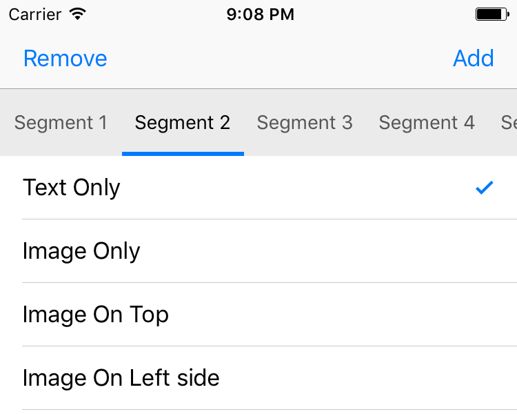
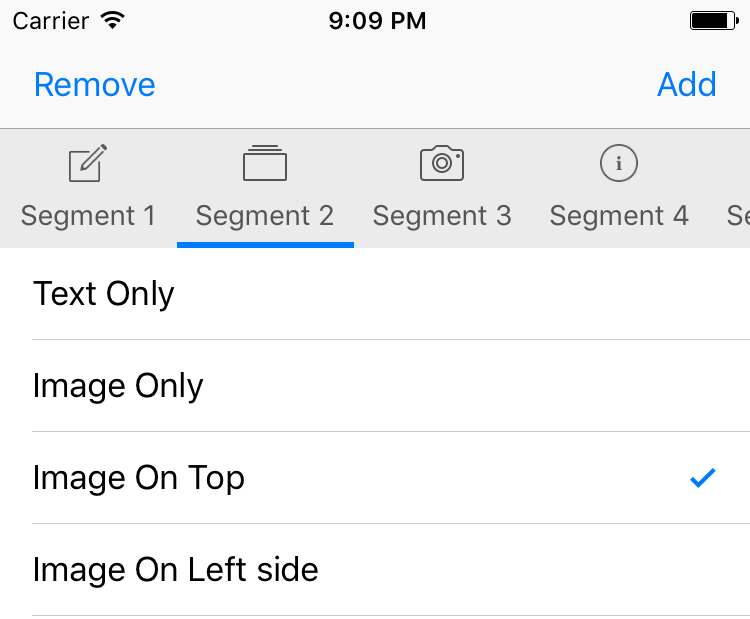
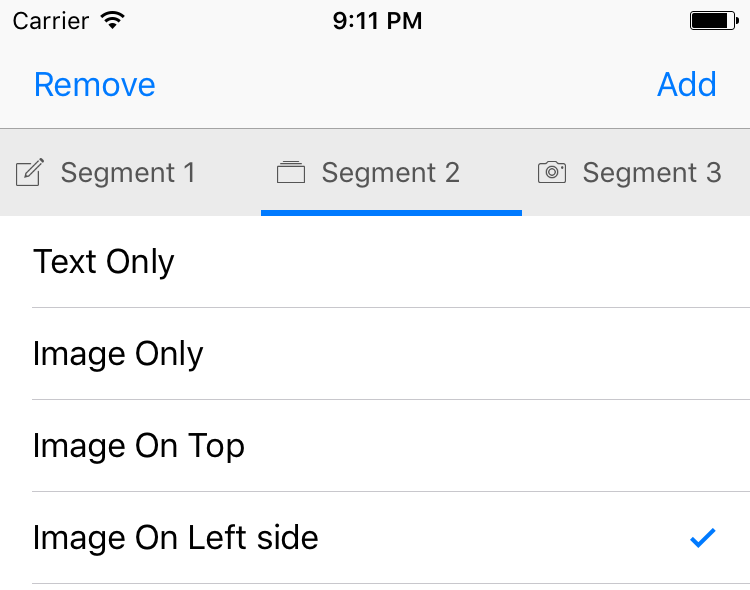

# ScrollableSegmentedControl

[](https://travis-ci.org/GocePetrovski/ScrollableSegmentedControl)
[](http://cocoadocs.org/docsets/ScrollableSegmentedControl)
[](http://cocoadocs.org/docsets/ScrollableSegmentedControl)
[](http://cocoadocs.org/docsets/ScrollableSegmentedControl)

ScrollableSegmentedControl is replacement for UISegmentedControl that becomes scrollable when the total width of all segments exceeds the width of the control itself. 

ScrollableSegmentedControl supports 4 styles of segments: text only, image only, text with image on top and text with image on left. 

|           Text Only           |           Image Only            |
|-------------------------------|---------------------------------|
|    |     |


|           Image On Top        |           Image On Left         |
|-------------------------------|---------------------------------|
| |  |


##Support

- Xcode 8.1+
- Swift 3.0+
- iOS 9.0+


# Usage

ScrollableSegmentedControl is designed to be used exactly same as UISegmentedControl. methods and properties are deliberately named same or very similar to ones found in UISegmentedControl.

```swift
@IBOutlet weak var segmentedControl: ScrollableSegmentedControl!
    
override func viewDidLoad() {
    super.viewDidLoad()

    segmentedControl.segmentStyle = .textOnly
    segmentedControl.insertSegment(withTitle: "Segment 1", image: #imageLiteral(resourceName: "segment-1"), at: 0)
	segmentedControl.insertSegment(withTitle: "Segment 2", image: #imageLiteral(resourceName: "segment-2"), at: 1)
    segmentedControl.insertSegment(withTitle: "Segment 3", image: #imageLiteral(resourceName: "segment-3"), at: 2)
    segmentedControl.insertSegment(withTitle: "Segment 4", image: #imageLiteral(resourceName: "segment-4"), at: 3)
    segmentedControl.insertSegment(withTitle: "Segment 5", image: #imageLiteral(resourceName: "segment-5"), at: 4)
    segmentedControl.insertSegment(withTitle: "Segment 6", image: #imageLiteral(resourceName: "segment-6"), at: 5)
        
    segmentedControl.underlineSelected = true
        
    segmentedControl.addTarget(self, action: #selector(TableViewController.segmentSelected(sender:)), for: .valueChanged)
}
    
func segmentSelected(sender:ScrollableSegmentedControl) {
    print("Segment at index \(sender.selectedSegmentIndex)  selected")
}
```

See the Demo project for example on how to use it. 


# Installation

### CocoaPods
The easiest way of installing ScrollableSegmentedControl is via [CocoaPods](http://cocoapods.org/). 

```
pod 'ScrollableSegmentedControl'
```

### Old-fashioned way
Just add `ScrollableSegmentedControl.swift` to your project.
